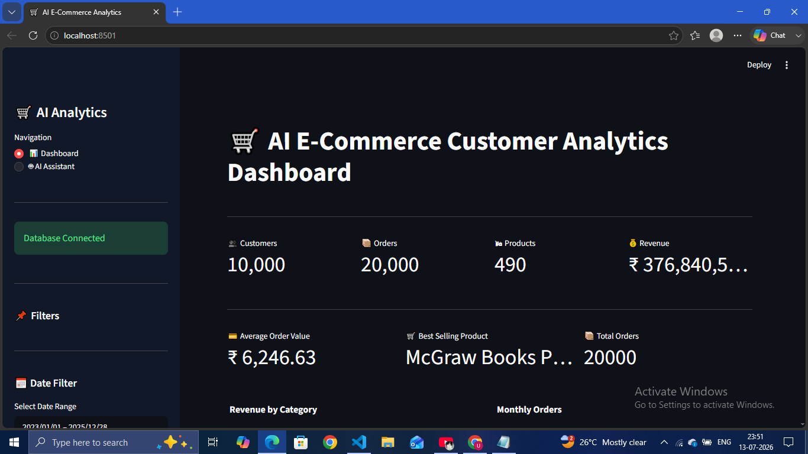
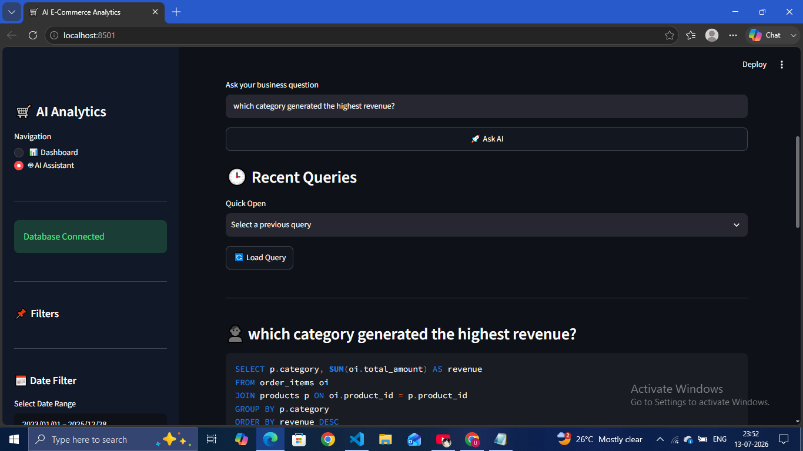
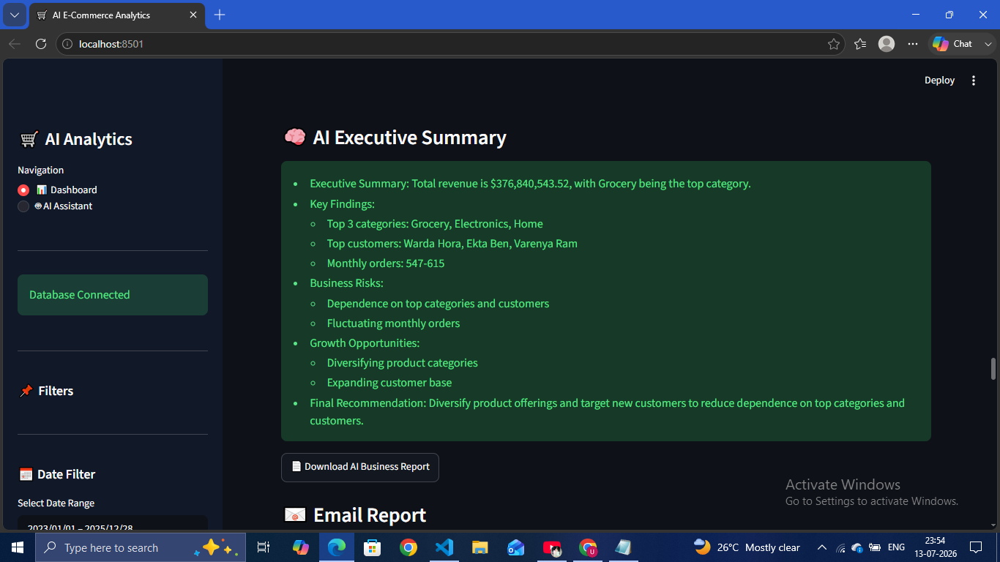
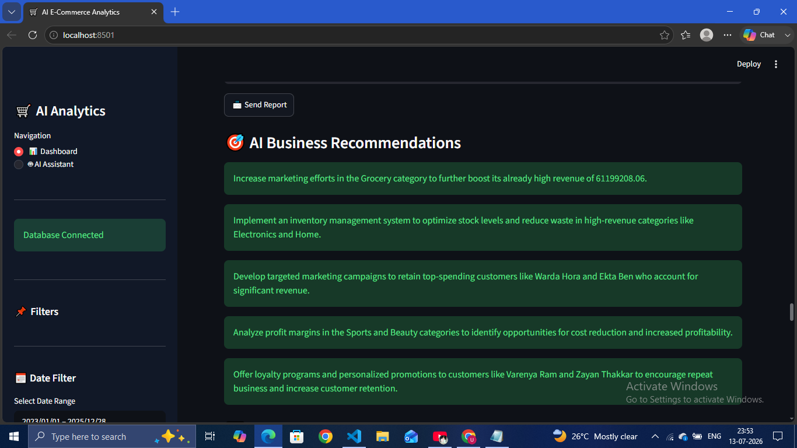
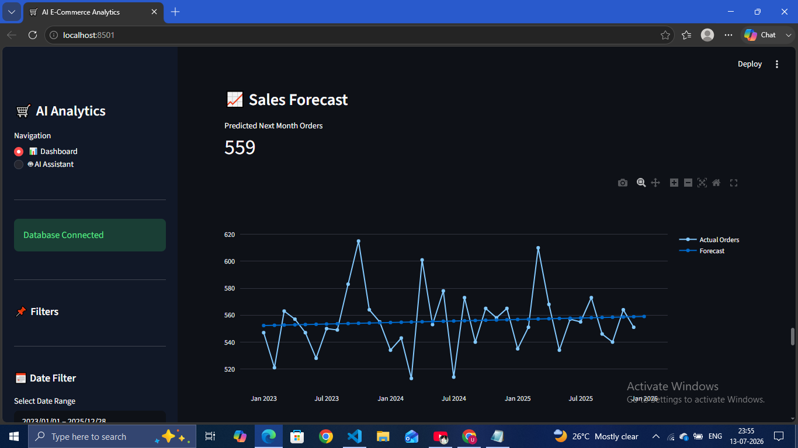

# AI-Powered E-Commerce Customer Analytics Platform

## Features

- AI SQL Chatbot (Natural Language → SQL)
- Interactive Streamlit Dashboard
- Revenue Analytics
- Customer Segmentation (RFM)
- AI Business Recommendations
- AI Executive Summary
- PDF Report Generation
- Excel Report Export
- Sales Forecasting
- Customer Lifetime Value (CLV)
- Top Products Dashboard
- Top Cities & States Analytics

## Tech Stack

- Python
- PostgreSQL
- SQL
- Pandas
- Streamlit
- Plotly
- Scikit-learn
- Groq LLM
- ReportLab

## Screenshots

### 📊 Main Dashboard
KPIs (Customers, Orders, Products, Revenue), revenue by category, and monthly order trends at a glance.



### 🤖 AI Assistant — Natural Language Queries
Ask business questions in plain English and get instant SQL generation plus results.



### 🧠 AI Executive Summary
Automatically generated business summary covering key findings, risks, and growth opportunities.



### 🎯 AI Business Recommendations
AI-generated, actionable recommendations based on revenue, category, and customer data.



### 📈 Sales Forecast
Predicted next month's order volume plotted against historical actuals.



## Installation

```bash
pip install -r requirements.txt
streamlit run dashboard/app.py
```

## Author

Umesh Kushwaha